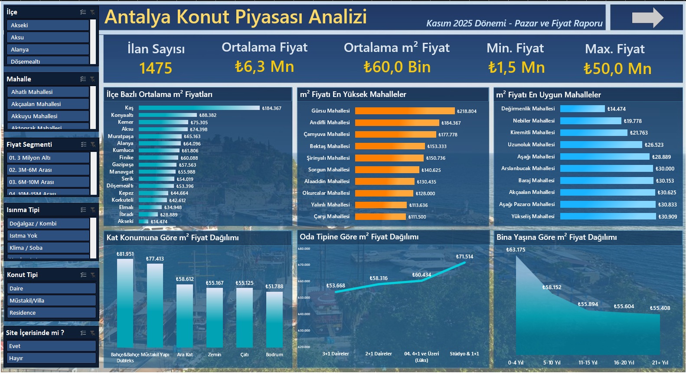
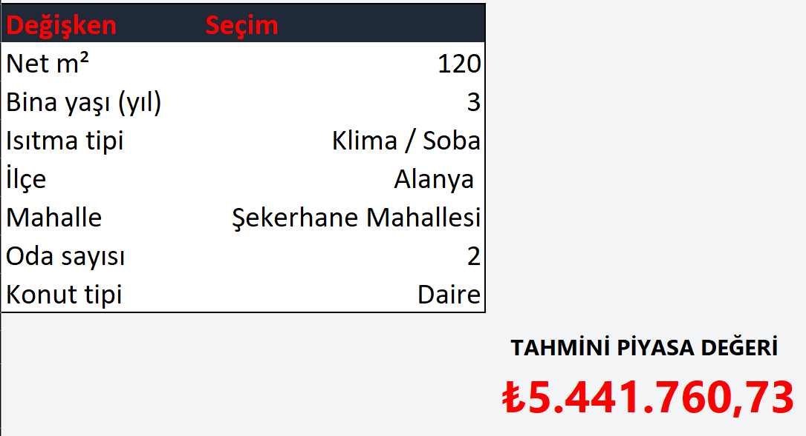

# 🏡 Emlak Veri Analizi & Fiyat Tahmin Projesi  
Bu proje, **Selenium ile veri çekme**, **Power Query – Power Pivot – Veri Modeli** kullanarak **etkileşimli emlak dashboard’ı** oluşturma ve **regresyon tabanlı fiyat tahmin paneli** geliştirme sürecini kapsayan uçtan uca bir veri analitiği çalışmasıdır.

---

## 🚀 Proje İçeriği ve Amaçları
Bu çalışmanın amacı:

- Emlak ilanlarını **Selenium ile otomatik olarak webden çekmek**  
- Veriyi **Excel → Power Query → Veri Modeli** sürecinden geçirip temizlemek  
- Power Pivot ile **ölçüler (measures)** oluşturmak  
- Excel üzerinde **profesyonel bir emlak dashboard'ı** tasarlamak  
- Regresyon analizi ile **fiyat tahmini paneli** oluşturmak  
- Projeyi bir veri analisti / iş zekası uzmanı portföy projesi formatına taşımak  

---

## 🧩 Kullanılan Teknolojiler
- **Python (Selenium)** – Web Scraping  
- **Excel** – Veri ilk alım  
- **Power Query** – Veri temizleme ve dönüştürme  
- **Power Pivot** – Veri Modeli, İlişkiler ve DAX Measures  
- **Pivot Table** – Dashboard veri kaynağı  
- **Excel Dashboard Design** – KPI’lar, Slicer’lar, Grafikler  
- **Regresyon Analizi** – Fiyat tahmin mekanizması  

---

## 📥 Veri Toplama (Selenium)
Proje, Emlakjet üzerinden konut ilanlarını otomatik çekmek için Selenium botu kullanır.

Toplanan örnek değişkenler:

- İl / İlçe / Mahalle  
- m², Oda Sayısı  
- Bina Yaşı  
- Kat Bilgisi  
- Isıtma Tipi  
- Fiyat  
- m² başına fiyat (Power Query’de hesaplandı)  

Elde edilen veri ilk olarak **Excel’e** aktarılmış, ardından Power Query ile işlenmiştir.

---

## 🔧 Veri Temizleme (Power Query)
Power Query’de yapılan dönüşümler:

- Sütun adlarının standartlaştırılması  
- Fiyat, m², bina yaşı gibi alanların sayısala çevrilmesi  
- Kategorik değişkenlerin segmentlere dönüştürülmesi  
- “Aralık” değerlerinin medyan/ortalama ile sayısallaştırılması  
- `Fiyat_m2` gibi yeni ölçütlerin oluşturulması  
- Regresyon için gerekli özelliklerin çıkarılması  

---

## 📐 Veri Modeli (Power Pivot)
Power Query’den gelen ana tablo **Veri Modeline yüklendi**.

Power Pivot’ta:

- İlişkiler oluşturuldu  
- KPI’lar için **DAX Measures** geliştirildi:
  - Ortalama m² Fiyat  
  - Ortalama Fiyat  
  - Minimum / Maksimum Fiyat  
  - İlan Sayısı  

Bu ölçüler dashboard’un temelini oluşturur.

---

## 📊 Dashboard (Sayfa 1)

### **KPI'lar**
- Ortalama m² Fiyat  
- Ortalama Fiyat  
- Min/Max Fiyat  
- Toplam İlan Sayısı  

### **Slicer’lar**
- İlçe  
- Mahalle  
- Bina Yaşı  
- Oda Sayısı  
- Kat  
- Isıtma Tipi  

### **Grafikler**
- İlçelere göre ortalama m² fiyat  
- Bina yaşına göre fiyat dağılımı  
- m² başına en pahalı / en ucuz mahalle  
- Kat durumuna göre fiyat değişimi  

Dashboard tamamen **etkileşimli** ve kullanıcı dostudur.

---

## 🤖 Fiyat Tahmin Paneli (Sayfa 2)

Regresyon modelinde kullanılan sayısallaştırılmış değişkenler:

- **m²**
- **Oda sayısı**
- **Bina yaşı (sayısal dönüşüm)**
- **Kat bilgisi (alt/orta/üst – sayısallaştırıldı)**
- **Isıtma tipi segmenti**
- **Mahalle / ilçe ortalama m² fiyatı** (kategorik yerine sayısal)
- **Site içinde mi?** (0/1)
- **Net/Bürüt m²** (temizlenmiş alanlar)

Tahmin paneli kullanımı:

1. Kullanıcı özellikleri seçer  
2. Sayısal değerler model girdisine gider  
3. Regresyon katsayıları uygulanır  
4. Panel aşağıda **tahmini fiyatı** gösterir

Excel üzerinde tamamen **dinamik bir tahmin sistemi** kurulmuştur.

---

---

## 🏁 Sonuç
Bu proje:

- **Gerçek hayat verisi** ile çalışır  
- **Tamamen uçtan uca** bir veri analitiği ve dashboard geliştirme sürecidir  
- Hem **iş zekası**, hem **veri toplama**, hem **modelleme** yeteneğini gösterir  
- GitHub portföyünde çok güçlü durur  

Eğer istersen proje için:

- Yeni bir tasarım  
- Daha gelişmiş ML modeli  
- Power BI versiyonu  
- Excel dosyasının optimize edilmesi  

gibi ek geliştirmeler de hazırlayabilirim.

